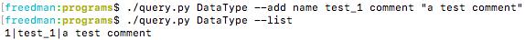
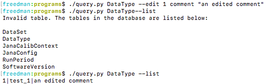
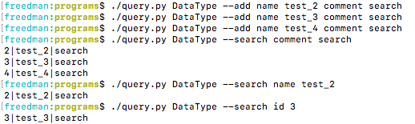
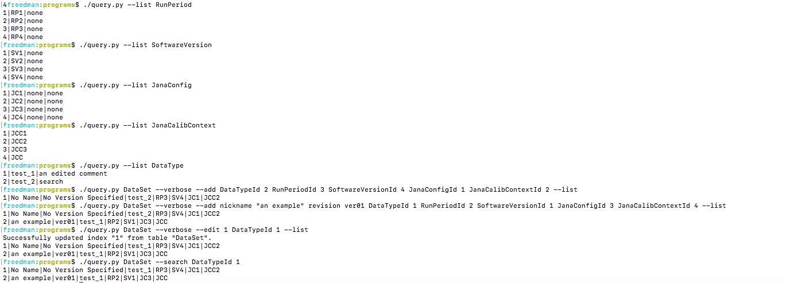

# Programs
This folder contains some programs along with their dependent files. Usage of the programs is described below.

# query.py
This command-line program is for general manipulation of the metadata database. It allows for (mostly) full control of the database.
 Basic usage of this program goes like this: <code>./query.py (table) (list of flags)</code> where (table) is the table to be 
used and (list of flags) can be anywhere from one flag to one of each, but must be at least one for proper usage.
  Adding records into the database: To add a record to a table, simply run the -a/--add flag <code>./query.py (table) -a name value (name value)</code>.
Additionally, to list all of the records in a table, use the -l/--list flag. An example is given below:  
Due to how the argument parsing works internally, specify the table before the -a/--add flag, otherwise it will interpret it as a part of a name-value pair.
On the other hand, using other flags after it is valid.
  Editing existing records: To edit a record with the -e/--edit flag, specify the index of the record, the attribute to be changed, and the new value.
Generally, it is: <code>./query.py (table) -e (index) (attribute) (newValue)</code>. An example is given below: 
  Searching the database: To search a table, use the -s/--search flag, specifying the attribute and the desired value of that attribute.
The general usage of it is: <code>./query.py (table) -s (attr) (value)</code>. Running this flag will print a list of all the records that meet the given criteria.
An example is given below: 
  Deleting a record: Deleting a record is simple, use the -d/--delete flag with the index (or id) of the record that you want to delete. General usage is: 
<code>./query.py (table) -d (index)</code>.
  Extras: When working with the DataSet table and its attributes related to records in other tables, manipulate the corresponding value ending with "Id". 
An example is given below:   
If you ever need to see the manipulatable attributes (that is, anything but the id and other DB internals)
the attributes of a given table can be listed as well, using the --show-attributes flag.
  Additionally, when the -v/--verbose flag is not selected, most errors will pass silently (but not all). Therefore, it is strongly recommended that
the -v/--verbose flag is selected.

# gluex_metadb_cmd.py
This command-line program is used for easier manipulation of the DataSet table, allowing the user to create a DataSet and list all of them.

# datasets_webpage.py
This is a simple CherryPy application that displays the DataSet table, organized by its RunPeriod. It uses a built-in python webserver to serve the webpage.
To start it up, simply run <code>./datasets_webpage.py</code> and the webpage will be running. If running locally, it will be on localhost:8080.
